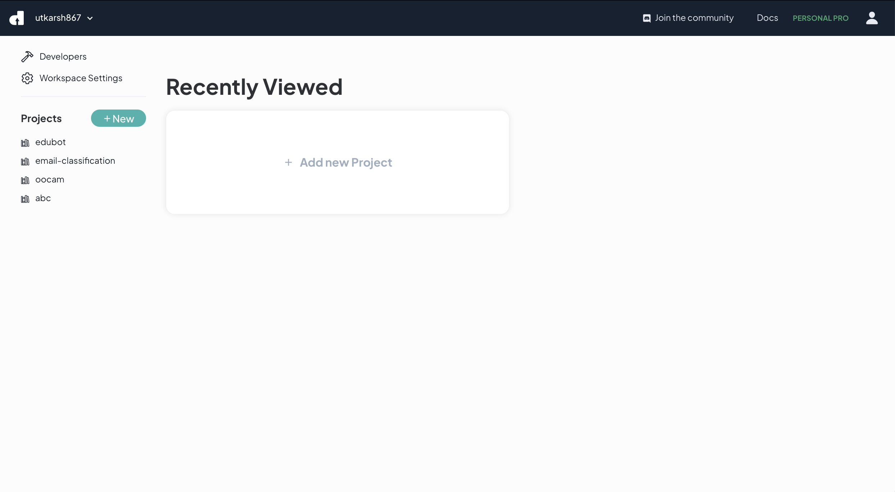
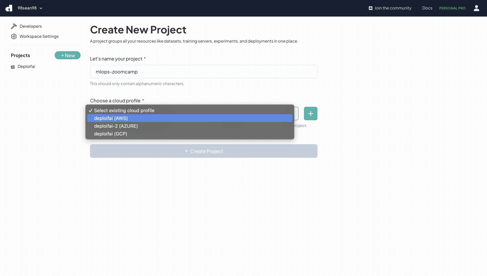
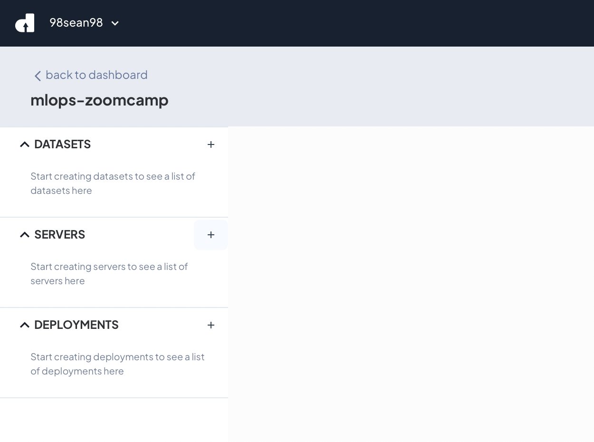
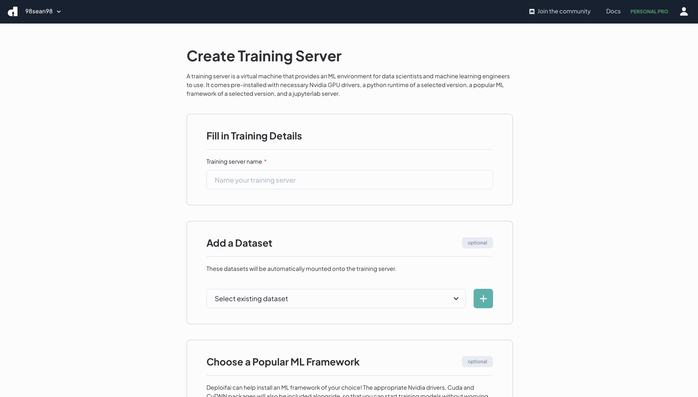
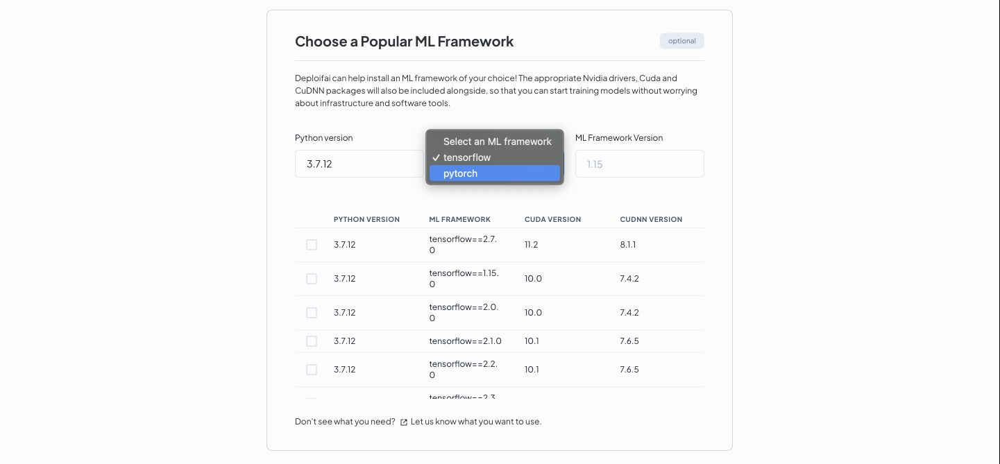
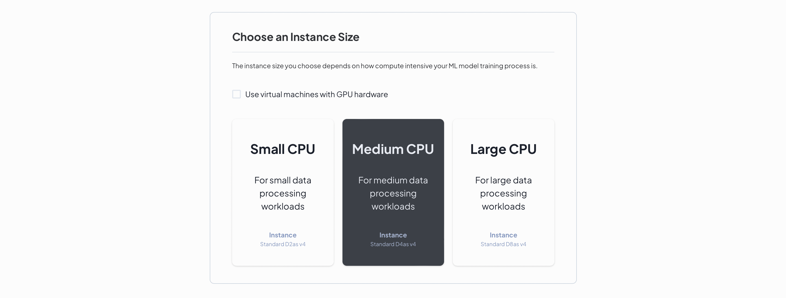
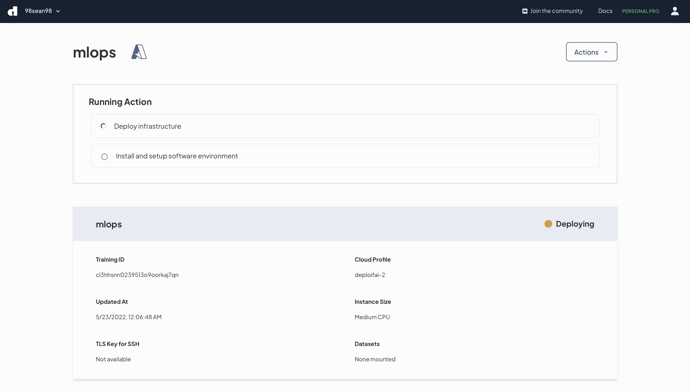

# Cloud server setup using Deploifai (on AWS, Azure, or GCP)

## Overview
This tutorial will show you how to deploy a server on either AWS, Azure, or GCP using your cloud account credentials with Deploifai.

A Deploifai orchestrated server contains
- a linux environment (Ubuntu 18.04)
- python of a specific version of your choice
- jupyterlab instance running on localhost:8000 (machine learning notebook)

## Why use Deploifai?

Deploifai helps unleash the power of cloud by automating the orchestration of cloud resources such as servers, data storages, and experiments for machine learning applications.

1. If you are new to cloud, it might be very tricky to learn how to create a server on cloud because there are so many options, and you may have to setup a static IP address which isn't obvious to beginners.

    Deploifai helps you to create a server on cloud with just a few clicks on a web UI.

2. Cloud providers provision VMs only with a bare-bones OS (in most cases, Linux).

    After orchestrating the actual server, Deploifai helps you install common packages and tools that are used for machine learning, so that you don't have to do it yourself.

## Cloud costs

Deploifai is currently free to use without any limits to the number of servers you can create. However, your cloud account is very likely to be subjected to server quotas, so you should be careful with how many servers you are creating.

Your cloud servers incur a cost depending on your chosen cloud provider. Please see their pricing details to know more. The servers you created are billed towards you directly, and Deploifai has no access to your billing information.

## Prerequisites

You should own a cloud account on either AWS, Azure, or GCP, and you can take advantage of cloud credits that you already own.

## Sign up on Deploifai

First, sign up on [Deploifai](https://deploif.ai) through Github.

## Cloud Profile

Create a [Deploifai cloud profile](https://docs.deploif.ai/cloud-services/connect-your-account) to be used to create cloud resources (namely the server, and some networking resources). This is based on the cloud provider of your choice.

For example, on AWS, you need to create an IAM with a set of access keys. Read more about how [here](https://docs.deploif.ai/cloud-services/connect-your-account/aws).

## Create a Project

Once you sign up to Deploifai, you are provided with a personal workspace that you can create a project in. A project is a space where you could create cloud resources for an ML application. On the dashboard you should see an **Add new Project** button.



The project needs a name and cloud profile.



It takes about 2 minutes to create the initial resources a project needs.

## Create a server

Navigate into your newly created project from the dashboard. Then click the + button next to **SERVERS** section in the left navigation pane.



You should see the server creation page. Fill in the fields as necessary.



You may choose to also add a dataset instance which is a file object storage on the cloud. The dataset will be mounted on the server, so that you could have easy access to your uploaded data.

Next, select a machine learning framework with the python version you want to use. I recommend using **PyTorch with python 3.9.12** for the MLOps course.



Then, select a cloud profile, you could just select the same one you used to create the project.

Finally, select a server instance size. Here you may choose to **just use VMs without GPU** because it is likely that if you just created your cloud account, you do not own any quota for GPU hardware.

I recommend using **Small CPU** for newly created cloud accounts.

Current free tier support (**Small CPU**):

| Cloud Provider | Instance Size                      | Description     |
|----------------|------------------------------------|-----------------|
| AWS            | t2.micro                           | 1-core, 1GB-RAM |
| Azure          | No Deploifai support for free tier |
| GCP            | e2-micro                           | 2-core, 1GB-RAM |



Then, click the create button.

You will have to wait about 20-25 minutes for the server to be provisioned, and all of its software packages to be installed. In the meantime, go grab a coffee.



## Connect to your server

Use SSH to connect to the server. There will be a private TLS key that you can download after the server is provisioned.

You may follow the other parts of the MLOps course to learn how to use SSH.

But in general, it should look something like this:

```shell
ssh -i deploifai_tls -L 8000:localhost:8000 ubuntu@<server-ip>
```

## Additional package installation for this course (Docker)

This course requires the use of Docker, but it is not installed yet. Deploifai is planning to add docker installation to the server orchestration process in the future.

So for now, you will need to install docker yourself.

Follow the following instructions. This section is referenced from [the official docker docs](https://docs.docker.com/engine/install/ubuntu).

1. Setup apt repository for docker, and install prerequisites.

```shell
sudo apt-get update

sudo apt-get install ca-certificates curl gnupg lsb-release
```

2. Add Docker's official GPG key.

```shell
curl -fsSL https://download.docker.com/linux/ubuntu/gpg | sudo gpg --dearmor -o /usr/share/keyrings/docker-archive-keyring.gpg
```

3. Use the following command to set up the stable repository. 

```shell
echo \
  "deb [arch=$(dpkg --print-architecture) signed-by=/usr/share/keyrings/docker-archive-keyring.gpg] https://download.docker.com/linux/ubuntu \
  $(lsb_release -cs) stable" | sudo tee /etc/apt/sources.list.d/docker.list > /dev/null
```

4. Install docker engine

```shell
sudo apt-get update
sudo apt-get install docker-ce docker-ce-cli containerd.io docker-compose-plugin
```

5. To avoid `sudo` command invoke, create `docker` user group and add your user to it, and activate changes.

```shell
sudo groupadd docker
sudo usermod -aG docker $USER
newgrp docker
```

6. Test docker installation

```shell
docker run hello-world
```

## Summary

1. Sign up on Deploifai
2. Create a cloud profile
3. Create a project
4. Create a server
5. Install additional packages

## Contact us

If you face any problems while using Deploifai, you can contact me at [seanchok@deploif.ai](mailto:seanchok@deploif.ai).

P.S. I'm also learning this course to build a better Deploifai for people like you in the machine learning space.
